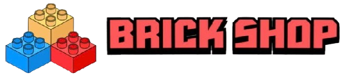
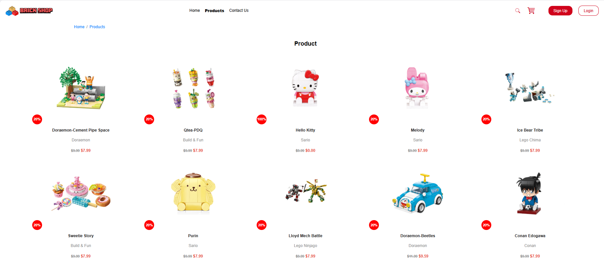
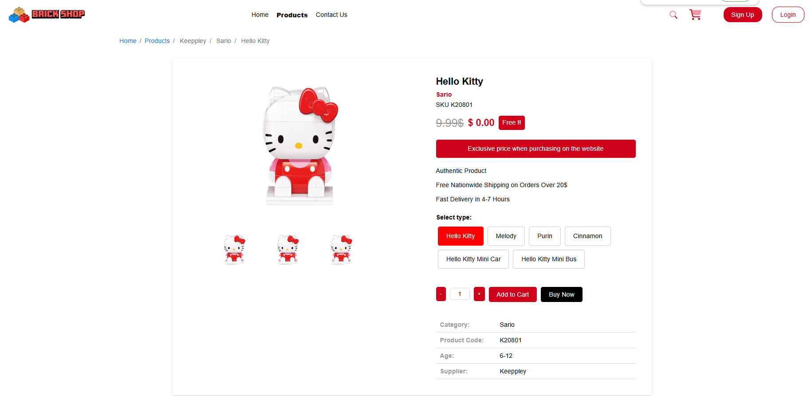
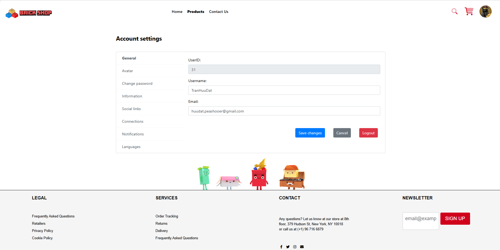
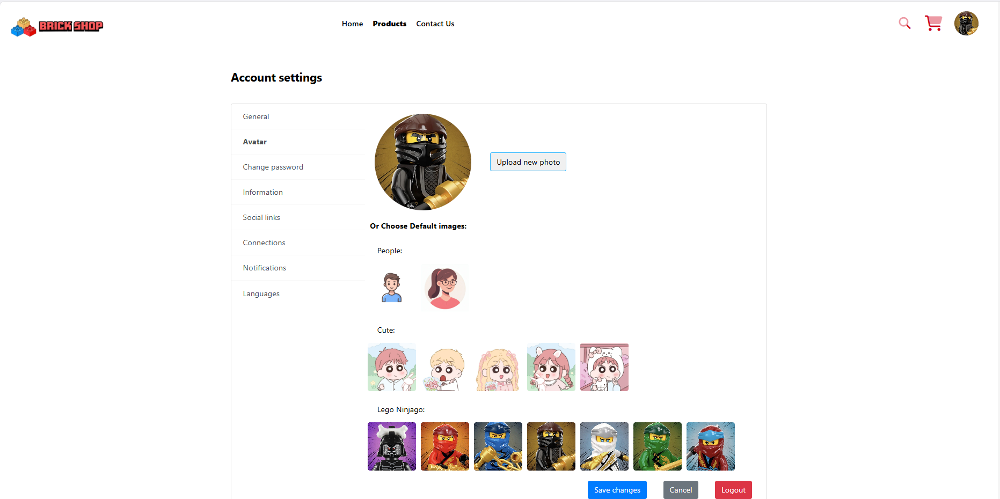
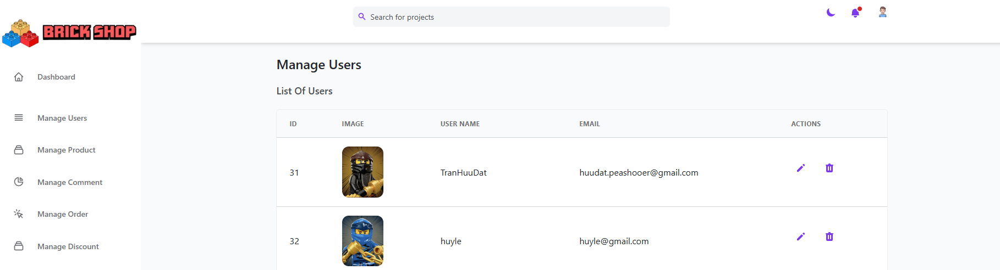
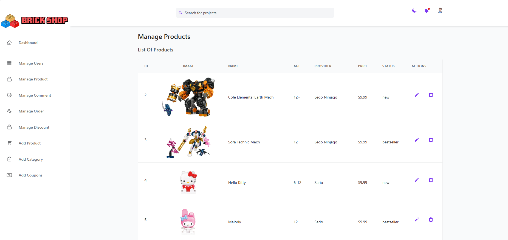
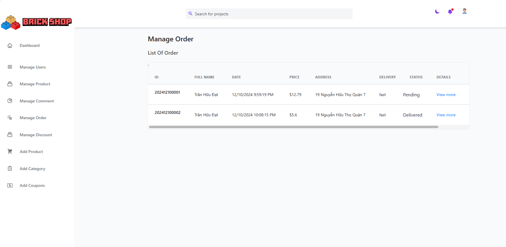

# BrickShop - Thiên đường Đồ chơi Lắp ráp 🧱

Chào mừng bạn đến với BrickShop, dự án website thương mại điện tử chuyên cung cấp các sản phẩm đồ chơi lắp ráp sáng tạo từ các thương hiệu hàng đầu như **Qman**, **Keeppley** và **LEGO**. Khám phá thế giới sáng tạo với đa dạng chủ đề từ Siêu nhân, Conan, Sanrio, Doraemon đến Ninjago, Chima, City và nhiều hơn nữa!

<p align="center">
  
  <!-- Thay thế link_den_logo_brickshop.png bằng link logo thật -->
</p>

## Mục lục

*   [Giới thiệu](#giới-thiệu)
*   [Tính năng chính](#tính-năng-chính)
    *   [Dành cho khách hàng](#dành-cho-khách-hàng)
    *   [Dành cho quản trị viên (Admin)](#dành-cho-quản-trị-viên-admin)
*   [Mô tả các trang chính (User)](#mô-tả-các-trang-chính-user)
*   **[Mô tả các trang chính (Admin)](#mô-tả-các-trang-chính-admin)** <!-- <<< THÊM MỤC NÀY -->
*   [Công nghệ sử dụng](#công-nghệ-sử-dụng)
*   [Ảnh chụp màn hình](#ảnh-chụp-màn-hình)
*   [Hướng dẫn cài đặt & Chạy dự án](#hướng-dẫn-cài-đặt--chạy-dự-án)
    *   [Yêu cầu](#yêu-cầu)
    *   [Các bước cài đặt](#các-bước-cài-đặt)
    *   [Biến môi trường](#biến-môi-trường)
    *   [Chạy dự án](#chạy-dự-án)
*   [Giấy phép (License)](#giấy-phép-license)
*   [Liên hệ](#liên-hệ)

## Giới thiệu

BrickShop là một nền tảng e-commerce nơi những người yêu thích đồ chơi lắp ráp có thể tìm thấy bộ sưu tập phong phú từ các thương hiệu Qman, Keeppley và LEGO. Dự án cung cấp trải nghiệm mua sắm trực tuyến hoàn chỉnh từ việc khám phá sản phẩm đến thanh toán và theo dõi đơn hàng, cùng với hệ thống quản trị cho phép chủ shop vận hành hiệu quả.


<!-- =================================================================== -->

## Công nghệ sử dụng

*   **Frontend:**
    *   HTML5
    *   CSS3
        *   **Bootstrap:** Framework CSS chính cho giao diện người dùng (khách hàng).
        *   **Tailwind CSS:** Framework CSS chính cho giao diện quản trị viên (admin).
    *   JavaScript 
*   **Backend:**
    *   Node.js, Express.js
*   **Database:**
    *   MySQL
    
## Tính năng chính

### Dành cho khách hàng

*   👤 **Xác thực & Quản lý Tài khoản:**
    *   Đăng ký, Đăng nhập, Đăng xuất.
    *   **Cài đặt hồ sơ (Profile Settings):** Cập nhật thông tin cá nhân (tên, email), đổi mật khẩu, quản lý địa chỉ, tùy chỉnh ảnh đại diện (upload hoặc chọn từ bộ sưu tập có sẵn), thêm/sửa liên kết mạng xã hội.
*   🧱 **Khám phá & Mua sắm:**
    *   Xem giới thiệu về các thương hiệu Qman, Keeppley, LEGO trên trang chủ.
    *   Duyệt toàn bộ sản phẩm hoặc lọc theo thương hiệu/chủ đề.
    *   Xem chi tiết sản phẩm: Hình ảnh (gallery), mô tả, giá, mã SKU, độ tuổi phù hợp, nhà cung cấp, các biến thể (nếu có), thêm vào giỏ hàng.
    *   Tìm kiếm sản phẩm.
*   🛒 **Giỏ hàng & Thanh toán:**
    *   Xem/chỉnh sửa sản phẩm trong giỏ hàng.
    *   Áp dụng mã **Voucher/Coupon** hợp lệ để được giảm giá.
    *   Thực hiện quy trình thanh toán (checkout).
    *   Tùy chọn **Thanh toán bằng Mã QR**.
*   🚚 **Quản lý Đơn hàng:**
    *   Xem lại lịch sử các đơn hàng đã đặt.
    *   **Theo dõi chi tiết đơn hàng:** Xem thông tin người nhận, địa chỉ, phương thức giao hàng, tổng tiền, ngày đặt, danh sách sản phẩm trong đơn hàng.


### Giao diện Khách hàng (Bootstrap)
| Trang chủ                               | Giới thiệu LEGO                       | Giới thiệu Qman                       |
| :--------------------------------------: | :-----------------------------------: | :-----------------------------------: |
|  |  |  |
| **Giới thiệu Keeppley**                   | **Trang Sản phẩm**                    | **Trang Chi tiết Sản phẩm**           |
| | |  |
| **Cài đặt tài khoản - Thông tin**        | **Cài đặt tài khoản - Avatar**        | **Cài đặt tài khoản - Mạng xã hội**   |
| | | |
| **Chi tiết Đơn hàng**                    |                                       |                                       |
| |                                       |                                       |


### Dành cho quản trị viên (Admin)

*   📊 **Dashboard:** Hiển thị thông tin tổng quan nhanh chóng: Tổng số đơn hàng, số lượng người dùng, số lượng sản phẩm, số lượng bình luận (?). (Phần danh sách Staff có thể là dữ liệu mẫu).
*   👥 **Quản lý Người dùng (Manage Users):** Xem danh sách tất cả người dùng đã đăng ký với thông tin ID, Ảnh đại diện, Tên người dùng, Email. Cung cấp các hành động như Chỉnh sửa (Edit) và Xóa (Delete) tài khoản người dùng.
*   🧱 **Quản lý Sản phẩm (Manage Product):** Hiển thị danh sách tất cả sản phẩm với ID, Ảnh, Tên, Độ tuổi, Nhà cung cấp (Provider), Giá, Trạng thái (ví dụ: new, bestseller), và các hành động Chỉnh sửa, Xóa.
*   💬 **Quản lý Bình luận (Manage Comment):** (Dựa trên menu) Cho phép quản trị viên xem và có thể là duyệt/xóa các bình luận về sản phẩm.
*   📦 **Quản lý Đơn hàng (Manage Order):** Liệt kê tất cả đơn hàng đã được đặt với ID, Tên khách hàng, Ngày đặt, Giá trị, Địa chỉ giao hàng, Phương thức vận chuyển, Trạng thái đơn hàng (ví dụ: Pending, Delivered). Cho phép xem chi tiết từng đơn hàng.
*   🏷️ **Quản lý Giảm giá (Manage Discount) / Coupons:** (Dựa trên menu) Quản lý các chương trình giảm giá hoặc mã coupon (voucher).
*   ➕ **Thêm Sản phẩm (Add Product):** Form cho phép quản trị viên nhập thông tin để thêm một sản phẩm mới, bao gồm Mã sản phẩm (Number), Tên (Tiếng Anh, Tiếng Việt), và tải lên nhiều hình ảnh sản phẩm.
*   📚 **Thêm Danh mục (Add Category):** (Dựa trên menu) Cho phép quản trị viên thêm mới các thương hiệu hoặc chủ đề sản phẩm.
*   🎟️ **Thêm Coupons (Add Coupons):** (Dựa trên menu) Form để tạo mã giảm giá/voucher mới.

<!-- =================================================================== -->
<!-- ===== THÊM PHẦN MÔ TẢ TRANG ADMIN ===== -->
<!-- =================================================================== -->

## Mô tả các trang chính (Admin)

*   **Dashboard:** Cung cấp cái nhìn tổng thể về hoạt động của cửa hàng thông qua các thẻ số liệu chính (Tổng đơn hàng, Người dùng, Sản phẩm, Bình luận). Giao diện chính để điều hướng đến các khu vực quản lý khác thông qua thanh menu bên trái.
*   **Manage Users (Quản lý Người dùng):** Hiển thị danh sách người dùng dưới dạng bảng, cho phép quản trị viên xem thông tin cơ bản và thực hiện các thao tác quản lý như sửa đổi hoặc xóa tài khoản.
*   **Manage Products (Quản lý Sản phẩm):** Trình bày danh mục sản phẩm dưới dạng bảng với các thông tin quan trọng. Quản trị viên có thể dễ dàng tìm kiếm, xem xét và thực hiện chỉnh sửa hoặc loại bỏ sản phẩm khỏi cửa hàng.
*   **Manage Order (Quản lý Đơn hàng):** Liệt kê các đơn hàng theo thời gian, hiển thị trạng thái xử lý (Pending, Delivered...). Cung cấp khả năng truy cập nhanh vào chi tiết đơn hàng để xem xét và cập nhật trạng thái khi cần thiết.
*   **Add Product (Thêm Sản phẩm):** Giao diện form nhập liệu chi tiết để bổ sung sản phẩm mới vào hệ thống, bao gồm tên đa ngôn ngữ và khả năng tải lên nhiều hình ảnh.

<!-- =================================================================== -->


### Giao diện Admin (Tailwind CSS)
| Dashboard                              | Quản lý Người dùng                     | Quản lý Sản phẩm                     |
| :-------------------------------------: | :------------------------------------: | :-----------------------------------: |
| |  | |
| **Quản lý Đơn hàng**                   | **Thêm Sản phẩm**                      |                                       |
| |  |                                       |

<!-- Thay thế link_anh_...png bằng đường dẫn đến ảnh chụp màn hình của bạn -->

## Hướng dẫn cài đặt & Chạy dự án

<!-- Giữ nguyên phần này như trước, đảm bảo nó chính xác -->
### Yêu cầu
*   Node.js (Phiên bản >= 16.x)
*   npm / yarn
*   MySQL Server (Đã cài đặt và đang chạy)
*   Git

### Các bước cài đặt
1.  **Clone repository:**
    ```bash
    git clone https://github.com/TranHuuDat2004/Keeppley_Nodejs
    cd ten_thu_muc_du_an
    ```
2.  **Cài đặt dependencies cho Backend:**
    ```bash
    cd backend # Hoặc thư mục backend của bạn
    npm install
    # hoặc: yarn install
    ```
3.  **Thiết lập Database:**
    *   Đăng nhập vào MySQL server.
    *   Tạo database mới (ví dụ: `keeppley-shop`).
    *   Import schema/chạy migrations để tạo các bảng cần thiết.

### Biến môi trường
1.  Trong thư mục `backend`, tạo file `.env`.
2.  Thêm các biến môi trường cần thiết (DB_HOST, DB_USER, DB_PASSWORD, DB_NAME, PORT, JWT_SECRET...).

### Chạy dự án
1.  **Chạy Backend Server:**
    ```bash
    cd backend
    npm start # Hoặc npm run dev
    ```
2.  **Mở Frontend:** Mở các file HTML trong trình duyệt, đảm bảo JS gọi đúng API backend.

## Giấy phép (License)

Dự án này được cấp phép dưới Giấy phép MIT. Xem file `LICENSE` để biết chi tiết.

## Liên hệ

[Trưởng nhóm: Trần Hữu Đạt / Thành Viên: Thùy Linh - Huy Lê] - [huudat.peashooer@gmail.com]

Link dự án: [https://github.com/TranHuuDat2004/Keeppley_Nodejs](https://github.com/TranHuuDat2004/Keeppley_Nodejs) <!-- Thay link repo thực tế -->